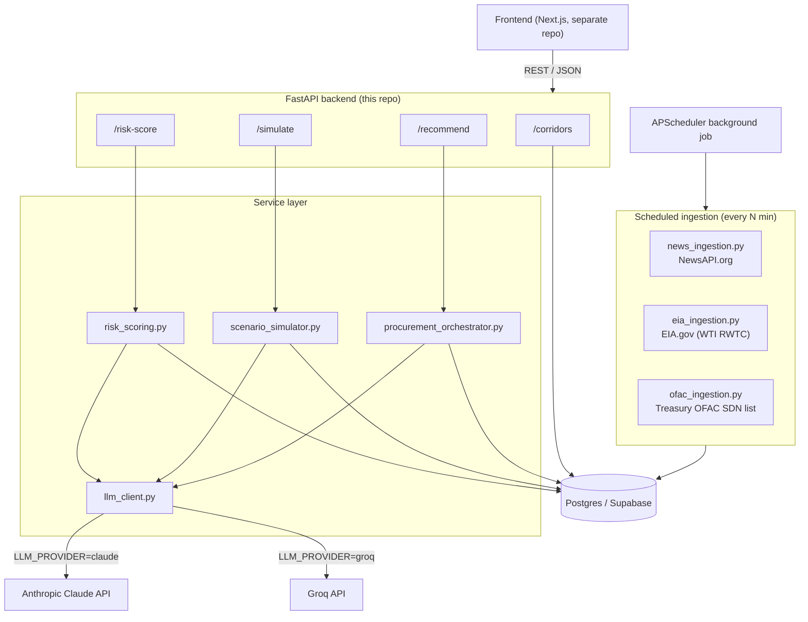
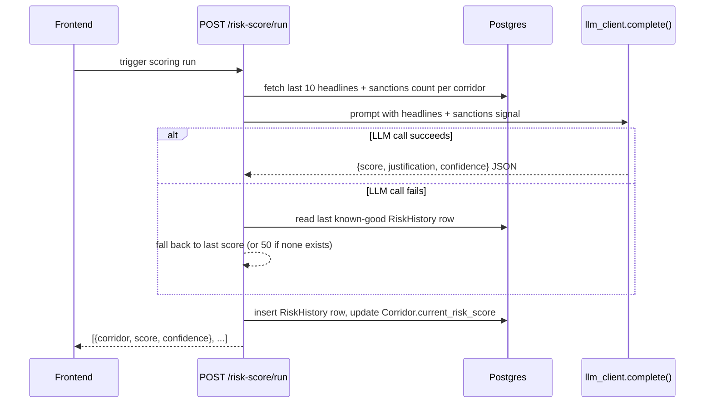
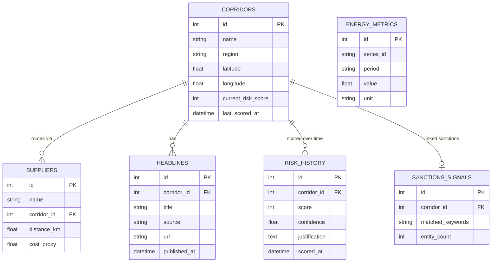

# EnerShield Backend


AI-driven energy supply-chain resilience API, built for the **PS1: Energy Resilience** OOSC 4.0 Hackathon. This is the backend that powers **EnerShield**  a dashboard that watches the shipping chokepoints India's crude oil imports depend on, and tells procurement teams when to worry.

**The problem.** A large share of India's crude oil imports pass through a handful of geopolitical chokepoints the Strait of Hormuz, the Red Sea, the Suez Canal while the country's strategic reserve covers only a matter of days. By the time a disruption makes headlines, it's often too late to react.

**The approach.** A live pipeline that scores corridor risk from real headlines and sanctions data, simulates the cascading impact of specific disruption scenarios using transparent formulas, and ranks alternate suppliers/routes with an LLM layered on top purely as the *explanation* engine, never as the source of the underlying numbers.

## Table of contents

- [Why it's useful](#why-its-useful)
- [Architecture](#architecture)
- [Data model](#data-model)
- [API reference](#api-reference)
- [Getting started](#getting-started)
- [Configuration](#configuration)
- [Usage examples](#usage-examples)
- [Running tests](#running-tests)
- [Current status](#current-status)
- [Getting help](#getting-help)
- [Maintainers & contributing](#maintainers--contributing)

## Why it's useful

- **Deterministic-first, LLM-second.** Risk scores, scenario impact numbers, and supplier rankings all come from transparent formulas over real cached data (headline volume, OFAC sanctions counts, live WTI crude price). The LLM's only job is to justify a score or narrate a scenario in plain language — every number on the dashboard traces back to a calculation, not a hallucination.
- **Pluggable LLM provider.** Swap between Anthropic Claude and Groq with one config value (`LLM_PROVIDER`) — no code changes required. Keep a fast/free provider for development and switch to Claude for a polished demo.
- **Real, cited assumptions.** Where the model needs an estimate (e.g. India's ~9.5-day reserve buffer, or oil-shock GDP elasticity), it's derived from named quantities — reserve barrels ÷ daily import volume — not asserted as a magic number.
- **Resilient by design.** Every external call (news API, EIA API, OFAC list, LLM) is wrapped so a single failure degrades gracefully — a flaky headline source shouldn't take down risk scoring, and a failed LLM call falls back to the last known-good score or a templated narrative instead of showing nothing.
- **Self-refreshing data.** A background scheduler (APScheduler) pulls fresh headlines, WTI crude prices, and sanctions data on a configurable interval, so the dashboard stays current without manual intervention.

## Architecture



**Design principle:** ingestion writes real data → services compute deterministic numbers from that data → the LLM is called last, only to phrase an explanation around numbers that already exist. If the LLM call fails at any point, the numeric result is unaffected.

### Request flow — scoring a corridor



## Data model



`ENERGY_METRICS` is not tied to a corridor directly — it holds a time series (currently WTI crude spot price, series `RWTC`) used by the scenario simulator to project price impact. A rendered version of this schema is also available as an image at [`res/db_schema.png`](res/db_schema.png), and the original hackathon problem brief is at [`res/PS1_Energy_Resilience_Build_Guide.pdf`](res/PS1_Energy_Resilience_Build_Guide.pdf).

## API reference

| Method | Path | Description |
|---|---|---|
| `GET` | `/health` | Liveness + DB connectivity check |
| `GET` | `/corridors` | All corridors with cached risk scores — powers the map |
| `GET` | `/corridors/{id}` | Single corridor detail |
| `GET` | `/corridors/{id}/headlines` | Headlines driving a corridor's score |
| `POST` | `/risk-score/run` | Score all corridors on demand |
| `POST` | `/risk-score/run/{id}` | Score a single corridor on demand |
| `GET` | `/risk-score/{id}/history` | Score trend over time, chronological order |
| `GET` | `/simulate/scenarios` | List pre-defined disruption scenarios |
| `POST` | `/simulate/{scenario_key}` | Run a scenario — deterministic impact + LLM narrative |
| `GET` | `/recommend` | Ranked alternate suppliers with LLM reasoning for the top 3 |

Full interactive documentation (Swagger UI) is generated automatically and available at `/docs` (and `/redoc`) on any running instance — that's the source of truth for request/response schemas, not this table.

## Getting started

### Prerequisites

- Python 3.13 (pinned in [`.python-version`](.python-version))
- A Postgres database — the project is built against [Supabase](https://supabase.com)
- API keys for whichever pieces you want live:
  - **NewsAPI.org** — headline ingestion
  - **EIA.gov** — WTI crude oil price data
  - **Anthropic** and/or **Groq** — LLM reasoning (OFAC sanctions data needs no key)

### Installation

1. Clone the repo and enter it:
   ```bash
   git clone https://github.com/nitin864/EnerShield_backend.git
   cd EnerShield_backend
   ```
2. Create a virtual environment and install dependencies:
   ```bash
   python3 -m venv venv
   source venv/bin/activate   # Windows: venv\Scripts\activate
   pip install -r requirements.txt
   ```
3. Copy the env template and fill in real values:
   ```bash
   cp .env.example .env
   ```
4. Create the database tables:
   ```bash
   python -m app.core.init_db
   ```
5. Seed starter corridors and suppliers:
   ```bash
   python -m app.core.seed_data
   ```
6. Run the dev server:
   ```bash
   uvicorn app.main:app --reload --port 8000
   ```
7. Verify it's up — open `http://localhost:8000/health`, you should see `{"status": "ok", "database": "connected", ...}`.

## Configuration

All settings are read once, centrally, in [`app/core/config.py`](app/core/config.py) — no module reads `os.environ` directly. Full list, mirrored in [`.env.example`](.env.example):

| Variable | Required | Default | Notes |
|---|---|---|---|
| `DATABASE_URL` | ✅ | — | Postgres connection string (SQLAlchemy `psycopg` driver) |
| `LLM_PROVIDER` | | `groq` | `"groq"` or `"claude"` — which provider `llm_client.py` calls |
| `ANTHROPIC_API_KEY` | if using Claude | — | |
| `CLAUDE_MODEL` | | `claude-haiku-4-5-20251001` | |
| `GROQ_API_KEY` | if using Groq | — | |
| `GROQ_MODEL` | | `openai/gpt-oss-20b` | |
| `NEWSAPI_KEY` | for headline ingestion | — | |
| `EIA_API_KEY` | for price ingestion | — | |
| `GUARDIAN_API_KEY` | optional | — | Reserved for a future headline source, not yet wired into ingestion |
| `ENV` | | `development` | |
| `CORS_ORIGINS` | | `http://localhost:3000` | Comma-separated list |
| `INGEST_INTERVAL_MINUTES` | | `15` | How often the background scheduler runs |
| `USE_SEEDED_FALLBACK` | | `true` | Reserved for demo-safety fallback behavior |

### Deployment

A ready-to-use [`render.yaml`](render.yaml) is included for deploying to [Render](https://render.com) — it wires up the same environment variables above as a Render web service (`uvicorn app.main:app --host 0.0.0.0 --port $PORT`).

## Usage examples

List corridors and their current risk scores:
```bash
curl http://localhost:8000/corridors
```

Run a scenario simulation (deterministic impact + LLM narrative):
```bash
curl -X POST http://localhost:8000/simulate/hormuz_closure
```

Get ranked alternate suppliers with reasoning:
```bash
curl http://localhost:8000/recommend
```

Trigger an on-demand scoring run right before a demo, so scores are guaranteed fresh:
```bash
curl -X POST http://localhost:8000/risk-score/run
```

## Running tests

```bash
pytest tests/ -v
```

Tests run against an in-memory SQLite database (see [`tests/test_models.py`](tests/test_models.py)) — no live Postgres connection needed.

## Current status

This backend is a hackathon build, developed module by module. Working end to end: the FastAPI scaffold, data models, scenario simulator, procurement orchestrator, risk scoring engine, OFAC ingestion, and the deployment config.

Known gaps to be aware of before relying on a fresh clone for a live demo:

- **`save_headline_if_new`** in [`app/services/news_ingestion.py`](app/services/news_ingestion.py) and **`save_metric_if_new`** in [`app/services/eia_ingestion.py`](app/services/eia_ingestion.py) are unimplemented stubs — the ingestion jobs run and hit the external APIs, but new rows are not yet persisted until these are filled in. Risk scoring and the scenario simulator will keep working off seeded/existing data in the meantime.
- Two tests in [`tests/test_models.py`](tests/test_models.py) (`test_corridor_headline_relationship`, `test_risk_history_ordering`) have their assertions left as `TODO`s.
- `GUARDIAN_API_KEY` and `USE_SEEDED_FALLBACK` are defined in config but not yet consumed anywhere in the codebase.

## Getting help

- **API reference:** interactive docs at `/docs` (Swagger) and `/redoc` on a running instance
- **Design context:** [`res/PS1_Energy_Resilience_Build_Guide.pdf`](res/PS1_Energy_Resilience_Build_Guide.pdf) has the original problem statement and design principles this backend follows
- **Issues:** open a GitHub issue on this repository for bugs or questions

## Maintainers & contributing

Maintained by [@nitin864](https://github.com/nitin864). This is an active hackathon build — issues and pull requests are welcome, especially for the stubbed functions and TODO tests listed above under [Current status](#current-status).

Licensed under the terms in the repository's `LICENSE` file (add one if it's missing before publishing).
