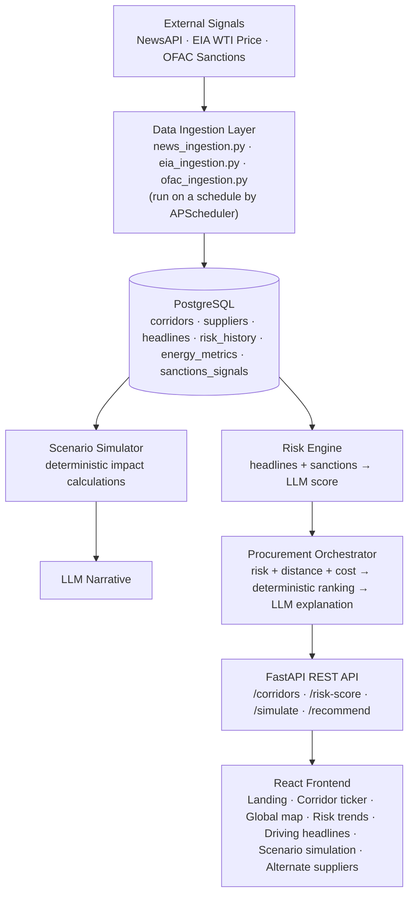

# EnerShield Backend


**AI-driven early-warning system for India's crude oil supply chain.** Built for the **PS1: Energy Resilience** OOSC 4.0 Hackathon.

> India holds only ~9.5 days of strategic crude reserves, and a large share of its imports pass through a handful of geopolitical chokepoints — the Strait of Hormuz, the Red Sea, the Suez Canal. By the time a disruption is front-page news, it's often too late to react. **Corridor Pulse watches these chokepoints in real time and tells procurement teams when to worry — and what to do about it.**

## What it does

| | |
|---|---|
| **Risk Scoring** | Scores each shipping corridor 0–100 from live headlines + OFAC sanctions data |
| **Scenario Simulation** | Models "what if Hormuz closes?" with real deterministic math — price, reserve days, GDP impact |
| **Supplier Recommendations** | Ranks alternate crude suppliers by risk, distance, and cost |
| **AI Explanations** | Claude/Groq narrates *why* — but never invents the numbers |

## Why it's different

- **Numbers first, AI second.** Every score, price projection, and ranking comes from a transparent formula over real data. The LLM only explains a result that already exists it never computes one. If the LLM call fails, the dashboard still shows a valid number.
- **Swap AI providers with one env var.** `LLM_PROVIDER=groq` (fast, free) or `claude` (polished) no code changes.
- **Fails soft, everywhere.** A dead news source, a rate-limited API, or a down LLM never crashes the pipeline — it falls back to the last known-good value.
- **Real assumptions, not guesses.** India's ~9.5-day reserve buffer is *derived* on the fly from reserve barrels ÷ daily import volume, not hardcoded.

## Architecture



## Quick start

```bash
git clone https://github.com/nitin864/EnerShield_backend.git
cd EnerShield_backend

python3 -m venv venv && source venv/bin/activate
pip install -r requirements.txt

cp .env.example .env        # fill in DATABASE_URL at minimum

python -m app.core.init_db      # create tables
python -m app.core.seed_data    # seed 5 corridors + suppliers

uvicorn app.main:app --reload --port 8000
```

Check `http://localhost:8000/health` → `{"status": "ok", "database": "connected"}`. Full interactive API docs (Swagger) at `/docs`.

**Minimum to run:** `DATABASE_URL` (Postgres/Supabase). **To see AI-generated scores/narratives:** set `LLM_PROVIDER` to `groq` or `claude` plus the matching key. **For live ingestion:** `NEWSAPI_KEY` and `EIA_API_KEY` (OFAC needs no key).

## API at a glance

| Endpoint | What it returns |
|---|---|
| `GET /corridors` | Live risk score per corridor — powers the map |
| `GET /corridors/{id}/headlines` | The headlines behind a score |
| `POST /risk-score/run` | Re-score all corridors on demand (great right before a demo) |
| `GET /simulate/scenarios` | Available disruption scenarios |
| `POST /simulate/{key}` | Deterministic impact + AI narrative for one scenario |
| `GET /recommend` | Ranked alternate suppliers with AI reasoning |

```bash
curl -X POST http://localhost:8000/simulate/hormuz_closure
curl http://localhost:8000/recommend
```

## Tests

```bash
pytest tests/ -v
```
## Deployment
Provided a render.yaml file for quick deployment on render.

Runs against an in-memory SQLite DB — no live database needed.

## Prototype status

Core scoring, simulation, and recommendation flows work end-to-end against seeded data. Two ingestion write-functions (`save_headline_if_new`, `save_metric_if_new`) are still stubs, so live headline/price *persistence* is the next piece to finish — everything downstream already works off existing data in the meantime.

## Help & contributing

- **API docs:** `/docs` and `/redoc` on a running instance
- **Problem brief:** [`res/PS1_Energy_Resilience_Build_Guide.pdf`](res/PS1_Energy_Resilience_Build_Guide.pdf)
- **Issues/PRs:** open on this repo — maintained by [@nitin864](https://github.com/nitin864)

Licensed under the terms in the repo's `LICENSE` file.
